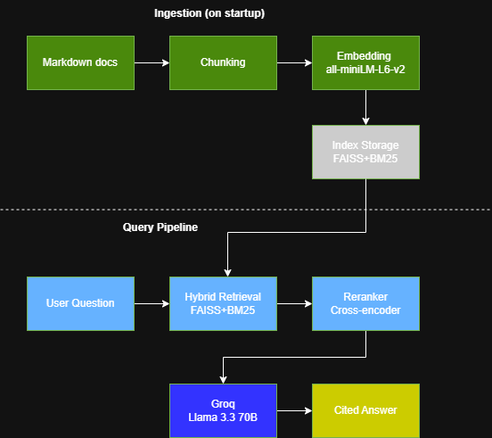

# RAG Troubleshooting Assistant

## Overview

A production-style troubleshooting assistant that helps engineers find answers from internal technical documentation. Instead of reading through lengthy documents or waiting for senior engineers to respond, engineers can ask a question in plain language and get an accurate, citation-backed answer in seconds.

The system retrieves relevant information from pre-ingested documents using a combination of keyword and semantic search, reranks results for precision, and generates grounded answers with citations pointing back to source documents.

In this implementation, Docker's official documentation is used as the sample dataset to demonstrate the system. The architecture is domain-agnostic and can be extended to work with any technical documentation in markdown format.

## Live Demo

Try the live application here: [RAG Troubleshooting Assistant on Hugging Face Spaces](https://rizwan99-troubleshooting-assisstance.hf.space/app)

## Motivation

Engineers and support teams spend a significant amount of time searching through documentation or relying on senior engineers for help with troubleshooting. This slows down resolution time and creates bottlenecks when experienced team members are unavailable.

This system solves that by making internal documentation searchable and conversational. Engineers ask a question, and the system finds the most relevant sections from the documentation and generates a clear answer — reducing time spent searching and lowering dependency on senior engineers for routine questions.

## Data Source

The system is built to work with any technical documentation in markdown format. For this project, Docker's official documentation (sourced from the [Docker documentation GitHub repository](https://github.com/docker/docs)) is used as the sample dataset. The documents cover containers, images, registries, Docker Compose, networking, and build optimization.

## Tech Stack

- **API:** FastAPI (Python)
- **Embeddings:** sentence-transformers (all-MiniLM-L6-v2)
- **Vector Store:** FAISS
- **Sparse Retrieval:** BM25 (rank-bm25)
- **Reranking:** Cross-encoder (ms-marco-MiniLM-L-6-v2)
- **LLM:** Groq (Llama 3.3 70B)
- **Frontend:** HTML/CSS/JS (served by FastAPI)
- **Containerization:** Docker
- **CI:** GitHub Actions
- **Deployment:** Hugging Face Spaces

## Architecture

The system follows a three-stage pipeline:

1. **Ingestion (on startup)** — When the application starts, it automatically loads markdown documents, splits them into chunks, embeds them using sentence-transformers, and stores them in a FAISS vector index. A BM25 index is also built from the same chunks for keyword matching.

2. **Retrieval** — When an engineer asks a question, the system runs two searches: BM25 for keyword matching and FAISS for semantic matching. Scores from both are normalized and combined using weighted score fusion (hybrid retrieval). A cross-encoder then reranks the top candidates for precision.

3. **Generation** — The top-ranked chunks are passed to the LLM along with the original question. The LLM generates an answer grounded in the retrieved context, with citations pointing back to source documents.


## Production Features

- **Retry logic** — Exponential backoff on LLM calls using tenacity. Only retries on transient errors (connection/timeout), not on permanent failures (auth errors).
- **Timeouts** — Connection and read timeouts on all external API calls to prevent hanging requests.
- **Rate limiting** — IP-based rate limiting using slowapi to protect the LLM endpoint from abuse and cost overruns.
- **Caching** — In-memory TTL cache for LLM responses. Repeated queries return cached results instantly, skipping retrieval and generation.
- **Token tracking** — Logs prompt and completion tokens per request. Exposes a `/token-usage` endpoint for monitoring API costs.
- **CI pipeline** — GitHub Actions runs linting and CI-gated evaluation on every push to main. If retrieval quality drops below defined thresholds, the pipeline fails.

## Project Structure

```
rag_project/
├── app/
│   ├── api/                # API route definitions
│   ├── core/               # Config, logging, middleware, exceptions
│   ├── schemas/            # Pydantic request/response models
│   ├── services/
│   │   ├── generation/     # LLM answer generation
│   │   ├── ingestion/      # Document loading, chunking, embedding
│   │   ├── monitoring/     # Token usage tracking
│   │   └── retrieval/      # Hybrid retriever, reranker
│   ├── utils/              # Text splitting, document loading
    |── prompt/             # System Prompt
│   └── main.py             # FastAPI app with lifespan startup
├── infra/                  # LLM client, vector store, cache, rate limiter, timeout
├── ui/                     # Frontend (HTML/CSS/JS)
├── eval/                   # Evaluation scripts and test dataset
├── data/                   # Source documents for ingestion
├── .github/workflows/      # CI pipeline
├── Dockerfile
├── requirements.txt
└── README.md
```

## API Endpoints

| Endpoint       | Method | Description                              |
|----------------|--------|------------------------------------------|
| `/app`         | GET    | Serves the frontend UI                   |
| `/`            | GET    | API version info                         |
| `/health`      | GET    | Health check                             |
| `/ask`         | POST   | Ask a question, get a cited answer       |
| `/token-usage` | GET    | View token usage summary                 |

## How to Run Locally

```bash
# Clone the repo
git clone https://github.com/yourusername/rag-troubleshooting-assistant.git
cd rag-troubleshooting-assistant

# Set up virtual environment
python -m venv myenv
source myenv/bin/activate  # Windows: myenv\Scripts\activate

# Install dependencies
pip install -r requirements.txt

# Set environment variables
cp .env.example .env  # add your Groq API key

# Run the app
uvicorn app.main:app --reload
```

### Usage

**Open the frontend:**
Visit [http://localhost:8000/app](http://localhost:8000/app) in your browser.

**Or use the API directly:**

```bash
# Ask a question
curl -X POST http://localhost:8000/ask \
  -H "Content-Type: application/json" \
  -d '{"query": "What is a Docker container?", "top_k": 5}'

# Check token usage
curl http://localhost:8000/token-usage
```

### Run with Docker

```bash
docker build -t rag-assistant .
docker run -d -p 8000:8000 --env-file .env rag-assistant
```

## Evaluation

The project includes a CI-gated evaluation pipeline that measures retrieval quality using a curated test dataset of 10 questions based on the ingested documentation.

**Metrics:**
- **Precision@5** — of the 5 returned chunks, how many were relevant
- **Recall@5** — of all relevant chunks, how many were found in the top 5
- **MRR** — how high the first relevant chunk appears in results

The CI pipeline fails automatically if any metric drops below its defined threshold, preventing quality regressions from being merged.

```bash
python eval/run_eval.py
```

## Design Decisions

- **Hybrid retrieval over dense-only:** Dense search misses exact keyword matches like error codes and technical terms. BM25 catches these. Combining both covers more query types.
- **Reranking stage:** Bi-encoders are fast but approximate. A cross-encoder reranker scores each chunk jointly with the query, improving precision on the final result set.
- **Auto-ingestion on startup:** Documents are ingested during application startup using FastAPI's lifespan events. This eliminates the need for a separate ingestion step and ensures the system is ready to serve immediately.
- **Stateless API:** No session state on the server, making it easy to scale horizontally behind a load balancer.
- **Cache before compute:** Repeated queries skip the entire pipeline and return cached results, reducing latency and API costs.
- **Retry only on transient failures:** Authentication and validation errors fail immediately. Only network and timeout errors trigger retries to avoid wasting time on unrecoverable failures.

## Future Improvements

- Agentic workflow with fallback logic and confidence scoring
- Persistent token usage tracking with database storage
- Support for additional document formats (PDF, HTML)
- User feedback loop to improve retrieval quality over time